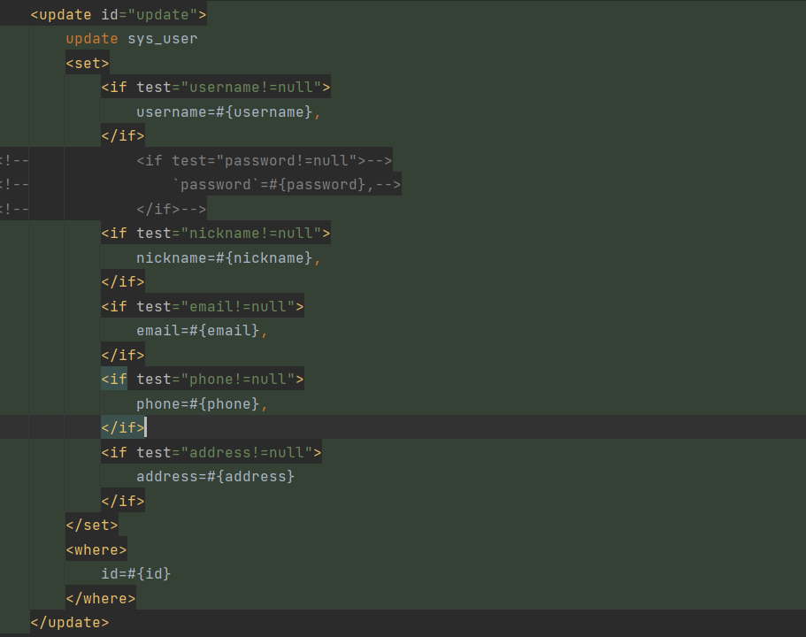
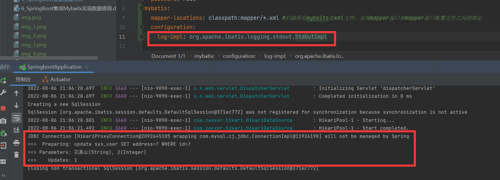
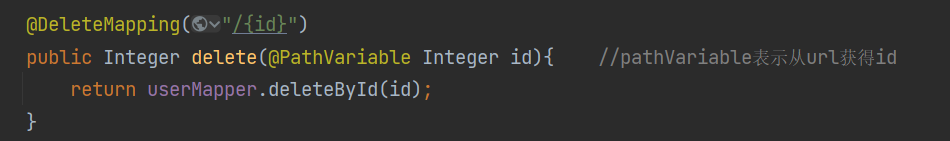
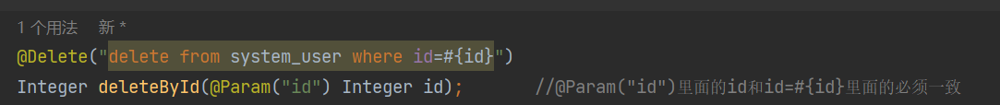
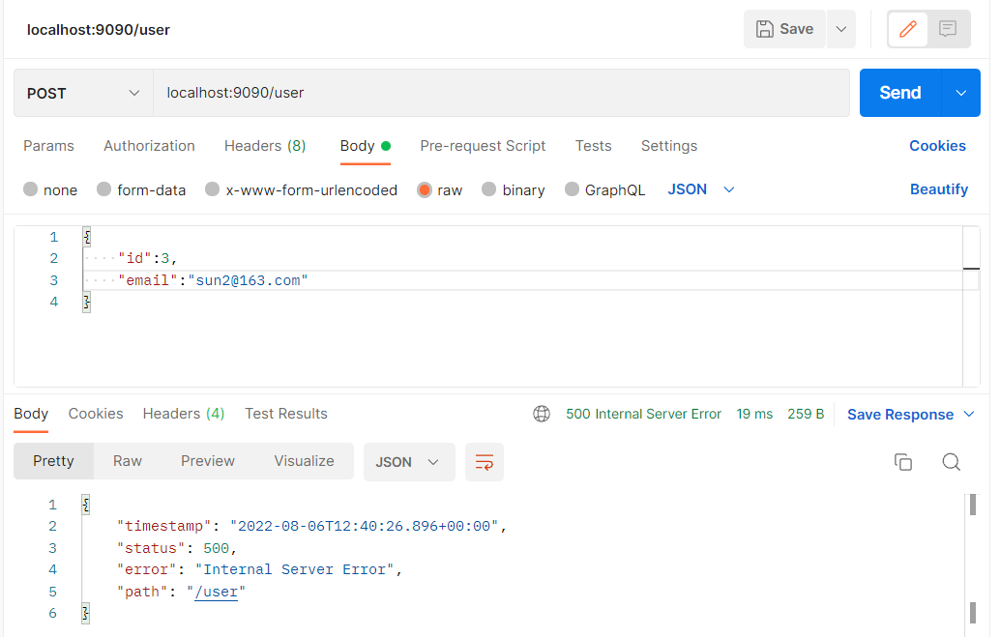
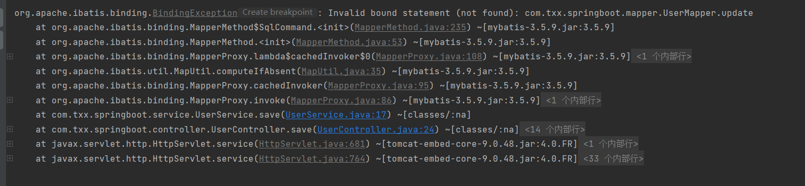
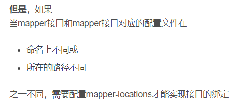
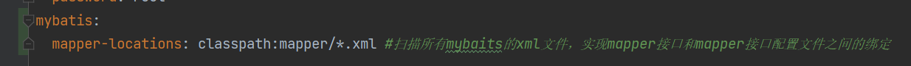

# ７＿SpringBoot实现增删改查

## 介绍
SpringBoot实现增删改查

## 学到的知识点
1. postman下载
https://www.postman.com/downloads/
2. postman测试接口

3. Mybatis中的${}和#{}区别
   https://blog.csdn.net/super_DuoLa/article/details/121971500?ops_request_misc=%257B%2522request%255Fid%2522%253A%2522165970678016780357264450%2522%252C%2522scm%2522%253A%252220140713.130102334.pc%255Fall.%2522%257D&request_id=165970678016780357264450&biz_id=0&utm_medium=distribute.pc_search_result.none-task-blog-2~all~first_rank_ecpm_v1~pc_rank_34-8-121971500-null-null.142^v39^pc_rank_34,185^v2^control&utm_term=MyBatis%E5%8A%A8%E6%80%81sql%E4%B9%8B%24%7B%7D%E5%92%8C%23%7B%7D%E5%8C%BA%E5%88%AB&spm=1018.2226.3001.4187
   https://blog.csdn.net/qq_43649799/article/details/119568634?utm_medium=distribute.pc_relevant.none-task-blog-2~default~baidujs_utm_term~default-1-119568634-blog-121971500.pc_relevant_default&spm=1001.2101.3001.4242.2&utm_relevant_index=4
4. ctrl+T 转到方法的实现
   Fn+F3 转到申明或用例
   Fn+Home or Fn+End 定位到该行的首尾
5. mybaits.xml的格式
6. 动态sql(用在update方法上，可以有效的防止数据被null覆盖)

7. 学会了mybaits打log

8. 假删除的概念（阿里风格01）
9. int和Integer的区别
   https://www.php.cn/java-article-442893.html
10. 

11. restful风格 https://www.cnblogs.com/aaaazzzz/p/13357601.html#:~:text=%E4%BB%80%E4%B9%88%E6%98%AFRESTful%E9%A3%8E%E6%A0%BC%EF%BC%9F,%E4%B8%80%E7%A7%8D%E8%BD%AF%E4%BB%B6%E6%9E%B6%E6%9E%84%E9%A3%8E%E6%A0%BC%E3%80%81%E8%AE%BE%E8%AE%A1%E9%A3%8E%E6%A0%BC%EF%BC%8C%E8%80%8C%E4%B8%8D%E6%98%AF%E6%A0%87%E5%87%86%EF%BC%8C%E5%8F%AA%E6%98%AF%E6%8F%90%E4%BE%9B%E4%BA%86%E4%B8%80%E7%BB%84%E8%AE%BE%E8%AE%A1%E5%8E%9F%E5%88%99%E5%92%8C%E7%BA%A6%E6%9D%9F%E6%9D%A1%E4%BB%B6%E3%80%82%20%E5%AE%83%E4%B8%BB%E8%A6%81%E7%94%A8%E4%BA%8E%E5%AE%A2%E6%88%B7%E7%AB%AF%E5%92%8C%E6%9C%8D%E5%8A%A1%E5%99%A8%E4%BA%A4%E4%BA%92%E7%B1%BB%E7%9A%84%E8%BD%AF%E4%BB%B6%E3%80%82

#### 遇到的问题及解决方案

1. postman验证接口的更新方法时报500

解决办法

##  UserController.java

package com.txx.springboot.controller;

import com.txx.springboot.entity.User;
import com.txx.springboot.mapper.UserMapper;
import com.txx.springboot.service.UserService;
import org.springframework.beans.factory.annotation.Autowired;
import org.springframework.web.bind.annotation.*;

import java.util.List;

@RestController
@RequestMapping("/user")
public class UserController {
@Autowired
private UserMapper userMapper;

    @Autowired
    private UserService userService;

    @PostMapping
    //新增和修改都是post接口
    public Integer save(@RequestBody User user){//前端传过来的json对象转化成为java类型的User对象
        //新增和更新都在这个userService.save()方法里面
        return userService.save(user);
    }

    @GetMapping
    //查询所有数据
    public List<User> index(){
        List<User> all = userMapper.findAll();
        return all;
    }
    @DeleteMapping("/{id}")
    public Integer delete(@PathVariable Integer id){    //pathVariable表示从url获得id
        return userMapper.deleteById(id);
    }
}

##  UserMapper.java

package com.txx.springboot.mapper;

import com.txx.springboot.entity.User;
import org.apache.ibatis.annotations.*;

import java.util.List;

//数据库查询的接口，专门用来和数据库交互用的
@Mapper
public interface UserMapper {
@Select("SELECT * FROM sys_user")
List<User> findAll();

    @Insert("INSERT INTO sys_user(username,`password`,nickname,email,phone,address) " +
            "VALUES (#{username},#{password},#{nickname},#{email},#{phone},#{address})")
    int insert(User user);

    int update(User user);

    @Delete("delete from sys_user where id=#{id}")
    Integer deleteById(@Param("id") Integer id);       //@Param("id")里面的id和id=#{id}里面的必须一致
}

## UserService.java

package com.txx.springboot.service;

import com.txx.springboot.entity.User;
import com.txx.springboot.mapper.UserMapper;
import org.springframework.beans.factory.annotation.Autowired;
import org.springframework.stereotype.Service;

@Service
public class UserService {
@Autowired
private UserMapper userMapper;

    public int save(User user){
        if(user.getId()==null){
            return userMapper.insert(user);
        }else{
            return userMapper.update(user);
        }

    }
}

## User.xml

<?xml version="1.0" encoding="UTF-8" ?>
<!DOCTYPE mapper PUBLIC "-//mybatis.org//DTD Mapper 3.0//EN" "http://mybatis.org/dtd/mybatis-3-mapper.dtd" >
<mapper namespace="com.txx.springboot.mapper.UserMapper">

    <update id="update">
        update sys_user
        <set>
            <if test="username!=null">
                username=#{username},
            </if>
<!--            <if test="password!=null">-->
<!--                `password`=#{password},-->
<!--            </if>-->
            <if test="nickname!=null">
                nickname=#{nickname},
            </if>
            <if test="email!=null">
                email=#{email},
            </if>
            <if test="phone!=null">
                phone=#{phone},
            </if>
            <if test="address!=null">
                address=#{address}
            </if>
        </set>
        <where>
            id=#{id}
        </where>
    </update>
</mapper>

##  application.yml

server:
port: 9090
spring.datasource:
driver-class-name: com.mysql.cj.jdbc.Driver
url: jdbc:mysql://localhost:3306/txx?serverTimezone=GMT%2b8
username: root
password: root
mybatis:
mapper-locations: classpath:mapper/*.xml #扫描所有mybaits的xml文件，实现mapper接口和mapper接口配置文件之间的绑定
configuration:
log-impl: org.apache.ibatis.logging.stdout.StdOutImpl

